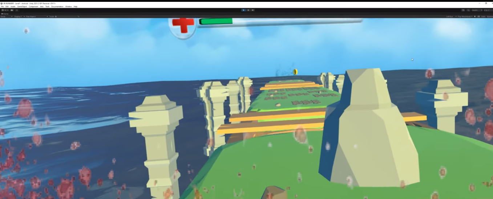
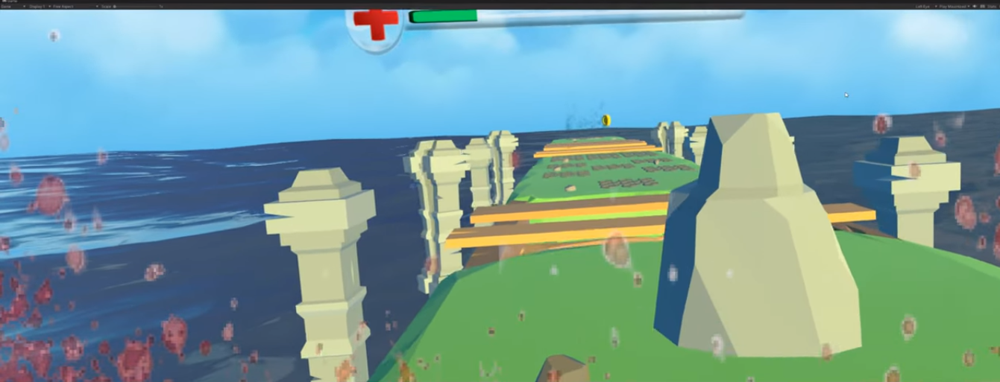
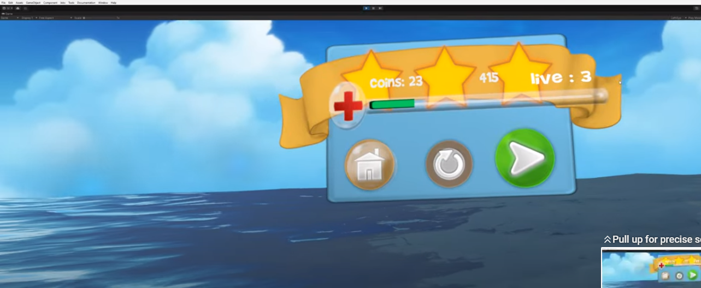

# VR Sonic Adventure

**Experience the thrill of Sonic like never before with VR Sonic Adventure! Dive into a virtual reality world of high-speed action where you use hand VR technology to collect coins and earn points, brought to you by SonicVR Studio.**

## 📌 Table of Contents

1. [About the Game](#about-the-game)
2. [Gameplay](#gameplay)
3. [Installation](#installation)
4. [Usage](#usage)
5. [Scoring](#scoring)
6. [Contribution](#contribution)
7. [License](#license)
8. [Contact](#contact)
9. [Acknowledgements](#acknowledgements)

## 🎮 About the Game

VR Sonic Adventure is not just a game; it's an immersive Sonic experience in the world of virtual reality. Step into the shoes of Sonic the Hedgehog and race through exciting environments, collecting coins and earning points in a whole new way.

## 🏃 Gameplay

### High-Speed Action

- **Virtual Sonic**: Control Sonic's movements with hand VR technology.
- **Race and Collect**: Speed through thrilling levels while collecting rings and dodging obstacles.
- **Sonic's Abilities**: Use hand gestures to perform Sonic's iconic moves like the Spin Dash.

### Immersive Environments

- **Stunning VR Worlds**: Explore visually stunning virtual worlds that bring Sonic's universe to life.
- **Interactive Elements**: Interact with the environment and discover hidden paths and power-ups.

### Multiplayer Mode

- **Challenge Friends**: Compete with friends or players online in multiplayer races.
- **VR Sonic Races**: Experience the adrenaline rush of Sonic races like never before.

### Gallery

## 💻 Installation

**Follow these instructions to play VR Sonic Adventure:**

1. **Requirements**
   - VR headset with hand-tracking technology (e.g., Oculus Quest)
   - Compatible VR-ready PC or gaming console
2. **Setup**
   - Download the VR Sonic Adventure game from the app store or platform.
   - Install the game following the on-screen instructions.

## 📱 Usage

**Here's how to get started with VR Sonic Adventure:**

1. Put on your VR headset and ensure it's properly calibrated.
2. Launch the game from your VR platform.
3. Use hand gestures to control Sonic's movements.
4. Race through levels, collect coins, and complete challenges.

## 🎖️ Scoring

In VR Sonic Adventure, your score is determined by the number of coins you collect and your completion time for each level. The more coins you gather and the faster you complete a level, the higher your score will be. Compete with friends and aim for the highest score!

## 🤝 Contribution

We welcome contributions from the Sonic and VR gaming communities. If you'd like to contribute, please fork the repository and create a new pull request.

## 📄 License

Distributed under the XYZ License. See `LICENSE` for more information.

## 📞 Contact

XREV Studio
- Email: contact@xrevstudio.com
- Twitter: [@XREVStudio](https://twitter.com/SonicVRStudio)

## 👏 Acknowledgements

- [Unity Engine](https://unity.com/)
- [Oculus SDK](https://developer.oculus.com/)
